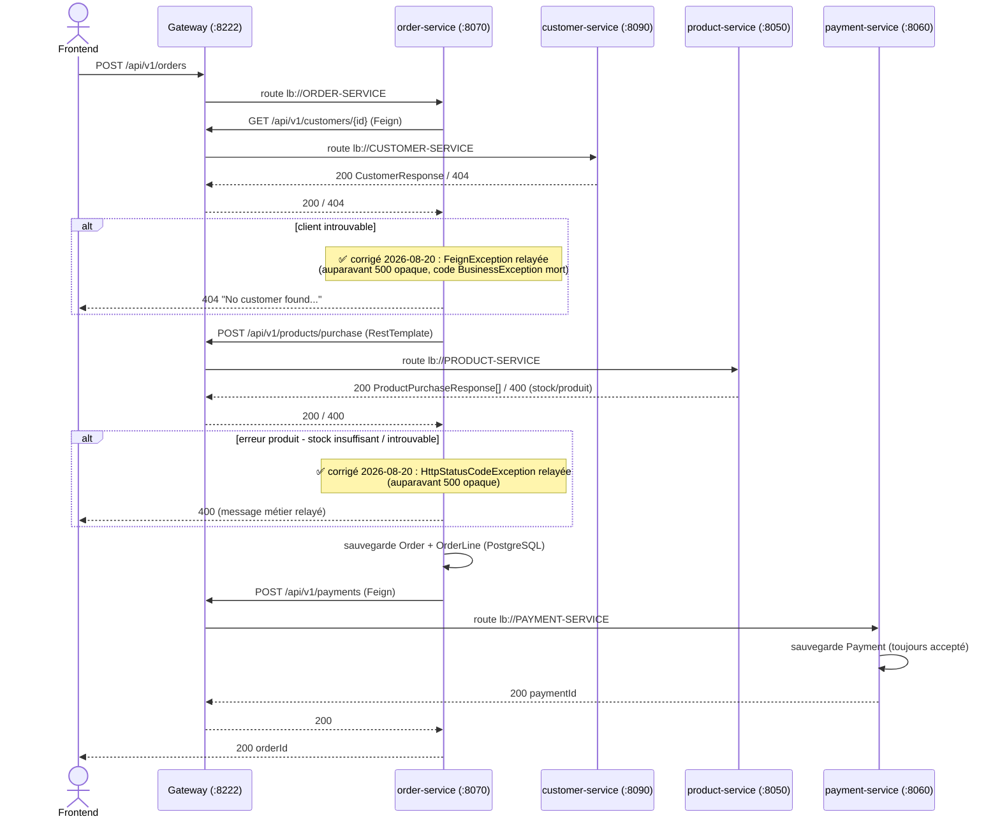
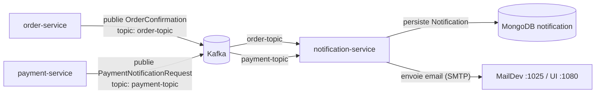
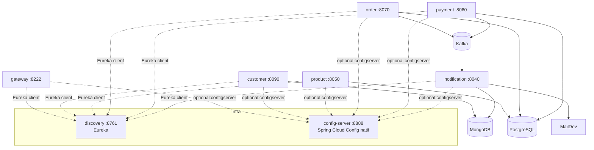

# Documentation API — ms-stock-management

Documentation produite par lecture directe du code source (contrôleurs, DTOs, handlers d'exception), **pas** par extraction d'une spécification OpenAPI/Swagger : aucune dépendance `springdoc-openapi` n'existe dans le repo (vérifié sur les 8 modules). Voir [gateway.md](api/gateway.md#agrégation-swagger) pour le détail.

Toutes les données ci-dessous ont été vérifiées contre le code du package `com.franck.*` (post-renommage Phase 1), sur la branche `refactor/rename-to-franck`.

## Sommaire

| Service | Rôle | Endpoints REST | Base path (via gateway) |
|---|---|---|---|
| [gateway](api/gateway.md) | Point d'entrée unique, routage | — (routeur) | `http://localhost:8222` |
| [customer](api/customer.md) | Référentiel clients (CRUD) | 6 | `/api/v1/customers` |
| [product](api/product.md) | Catalogue produits + décrément de stock | 4 | `/api/v1/products` |
| [order](api/order.md) | Orchestration des commandes | 4 (2 contrôleurs) | `/api/v1/orders`, `/api/v1/order-lines` |
| [payment](api/payment.md) | Enregistrement des paiements (simulé) | 1 | `/api/v1/payments` |
| [notification](api/notification.md) | Consommateur Kafka + email (pas de REST) | 0 | — |

Services d'infrastructure non documentés ici (pas d'API métier) : `discovery` (Eureka, `:8761`), `config-server` (Spring Cloud Config natif, `:8888`).

**Authentification** : aucune, sur l'ensemble des services et de la gateway (pas de Spring Security/Keycloak/OAuth2 dans le repo — hypothèse initiale invalidée en Phase 0, décision actée : documenté tel quel).

---

## Flux d'appels inter-services

### Synchrone — création d'une commande (`POST /api/v1/orders`)

Tous les appels sortants d'`order-service` passent par la **gateway** (`localhost:8222`), pas directement vers les services cibles (URLs configurées ainsi dans `config-server`).

### Asynchrone — confirmations via Kafka

- `order-service` publie sur `order-topic` **après** que `payment-service` a répondu avec succès (dernière étape du flux synchrone).
- `payment-service` publie sur `payment-topic` **juste après** avoir persisté le paiement — indépendamment du flux `order-service` (peut aussi être déclenché par un appel direct à `POST /api/v1/payments`, hors flux commande).
- Les deux flux Kafka sont **fire-and-forget** : aucun accusé de réception n'est renvoyé au flux synchrone, et un échec d'envoi d'email n'a aucun impact sur la réponse HTTP de `POST /api/v1/orders` ou `POST /api/v1/payments`. ✅ Un échec d'envoi d'email déclenchait auparavant une tempête de retries Kafka + des doublons MongoDB + une perte silencieuse de la notification — **corrigé le 2026-08-20**, voir [notification.md](api/notification.md#-bug-critique-corrigé-le-2026-08-20--tempête-de-retries-kafka--doublons-mongodb-sur-échec-demail).

### Vue d'ensemble statique

---

## Points transverses — résultats Phase 3 (tout finalisé le 2026-08-20)

> Cette section a été mise à jour après exécution réelle des tests, puis après correction et revalidation des 6 bugs identifiés + des 3 points restés ouverts (voir [TEST_REPORT.md](TEST_REPORT.md) pour le détail complet).

1. **Aucune authentification** — confirmé : aucun 401/403 n'existe nulle part dans le backend (décision actée en Phase 0 : documenté tel quel, non implémenté).
2. **"Paiement refusé" n'existe pas** — confirmé : `payment-service` accepte toujours le paiement en tant que tel (la validation ajoutée rejette désormais les données structurellement invalides — montant négatif, email mal formé — mais il n'y a toujours aucune logique de refus métier), voir [payment.md](api/payment.md).
3. ~~**Incohérence des codes d'erreur "ressource introuvable"**~~ — ✅ corrigé : `product-service` renvoie désormais `404` comme `customer`/`order`.
4. ~~**`POST /api/v1/orders` renvoie `500` opaque pour les 3 cas métier gérés en aval**~~ — ✅ corrigé : `404` (client introuvable) et `400` (produit introuvable/stock insuffisant) avec messages métier relayés.
5. ~~**🔴 Bug critique** : tempête de retries Kafka + doublons MongoDB sur échec d'email~~ — ✅ corrigé (`@EnableAsync` + catch élargi), voir [notification.md](api/notification.md).
6. ~~**🔴 Bug** : montant (`amount`) d'une commande jamais persisté~~ — ✅ corrigé (`OrderMapper.toOrder()` complété).
7. ~~**CORS non configuré côté gateway**~~ — ✅ corrigé et revalidé par une requête `OPTIONS` preflight réelle, voir [gateway.md](api/gateway.md#cors).
8. ~~**Pas de transaction distribuée/saga** : stock jamais restauré si le paiement échouait après décrément~~ — ✅ compensation de stock (saga légère) ajoutée et revalidée (`payment-service` coupé artificiellement, stock confirmé restauré), voir [order.md](api/order.md#-compensation-de-stock-saga-légère--ajoutée-le-2026-08-20). Reste une solution best-effort, pas une saga complète.
9. ~~**Nom Feign trompeur** `@FeignClient(name="product-service")` sur `PaymentClient`~~ — ✅ corrigé.
