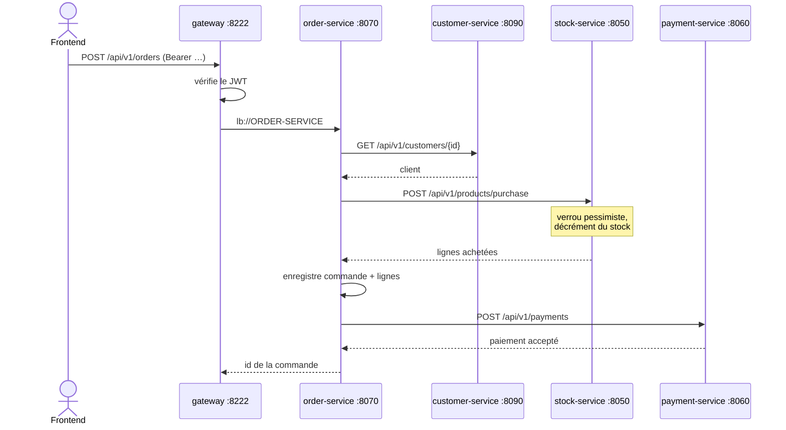

# Documentation API

Toutes les routes sont exposées par la **passerelle** : `http://localhost:8222`.
Les services ne sont pas joignables directement depuis l'extérieur.

Cette documentation est établie par lecture du code (contrôleurs, DTO, handlers
d'exception). Aucune dépendance `springdoc-openapi` n'est présente : il n'existe
pas de spécification OpenAPI générée.

## Sommaire

| Service | Rôle | Base path |
|---|---|---|
| [auth](api/auth.md) | Authentification, utilisateurs, rôles | `/api/v1/auth`, `/api/v1/users` |
| [stock](api/stock.md) | Produits, catégories, fournisseurs, mouvements | `/api/v1/products`, `/categories`, `/suppliers`, `/stock-movements` |
| [customer](api/customer.md) | Référentiel clients | `/api/v1/customers` |
| [order](api/order.md) | Orchestration des commandes | `/api/v1/orders`, `/api/v1/order-lines` |
| [payment](api/payment.md) | Enregistrement des paiements | `/api/v1/payments` |
| [notification](api/notification.md) | Consommateur Kafka, envoi d'e-mails | aucune API REST |
| [gateway](api/gateway.md) | Routage et sécurité | — |

---

## Authentification

**Toute requête hors liste blanche exige un jeton JWT valide.** La passerelle
vérifie la signature et l'expiration, puis transmet l'identité en aval via les
en-têtes `X-User-Name` et `X-User-Role`.

Chemins accessibles sans jeton :

```
POST /api/v1/auth/login
POST /api/v1/auth/register
POST /api/v1/auth/forgot-password
POST /api/v1/auth/reset-password
```

Obtenir un jeton puis l'utiliser :

```bash
TOKEN=$(curl -s -X POST http://localhost:8222/api/v1/auth/login \
  -H 'Content-Type: application/json' \
  -d '{"username":"admin","password":"admin123!"}' | jq -r .token)

curl -H "Authorization: Bearer $TOKEN" http://localhost:8222/api/v1/products
```

Sans en-tête `Authorization`, la passerelle répond :

```json
HTTP/1.1 401 Unauthorized
{"status":401,"message":"Jeton d'authentification absent"}
```

### Rôles

`ADMIN` · `GERANT` · `MAGASINIER` · `VENDEUR` · `ACHETEUR` · `COMPTABLE` · `OBSERVATEUR`

L'inscription libre attribue systématiquement `OBSERVATEUR`. Le DTO d'inscription
ne comporte pas de champ `role` : l'attribution d'un rôle relève de
`PUT /api/v1/users/{id}/role`, réservé aux `ADMIN`.

---

## Flux inter-services

### Synchrone — création d'une commande

Les appels sortants d'`order-service` sont résolus par **Eureka**, pas par la
passerelle : le trafic interne ne traverse plus le point d'entrée public.



**Compensation.** Le décrément de stock est un appel synchrone effectué hors de la
transaction JPA locale : un rollback Spring ne l'annule pas. Toute erreur survenant
après ce décrément déclenche donc `POST /api/v1/products/restore`. Cette compensation
est *best-effort* : son propre échec est journalisé en ERROR sans masquer l'exception
d'origine.

### Asynchrone — Kafka

| Topic | Producteur | Consommateur | Effet |
|---|---|---|---|
| `order-topic` | order-service | notification-service | E-mail de confirmation de commande |
| `payment-topic` | payment-service | notification-service | E-mail de confirmation de paiement |
| `password-reset-topic` | auth-service | notification-service | E-mail contenant le lien de réinitialisation |

Le consommateur restreint la désérialisation à `com.gestionstock.*`.

---

## Format des erreurs

```json
{
  "timestamp": "2026-09-22T12:00:00",
  "status": 400,
  "message": "Stock insuffisant pour le produit 3 (disponible : 2, demandé : 5)"
}
```

Sur une erreur de validation, un objet `errors` associe chaque champ à son message.

| Code | Signification |
|---|---|
| 400 | Requête invalide, règle métier violée (stock insuffisant…) |
| 401 | Jeton absent, invalide ou expiré |
| 403 | Rôle insuffisant |
| 404 | Ressource introuvable |
| 409 | Conflit d'intégrité |
